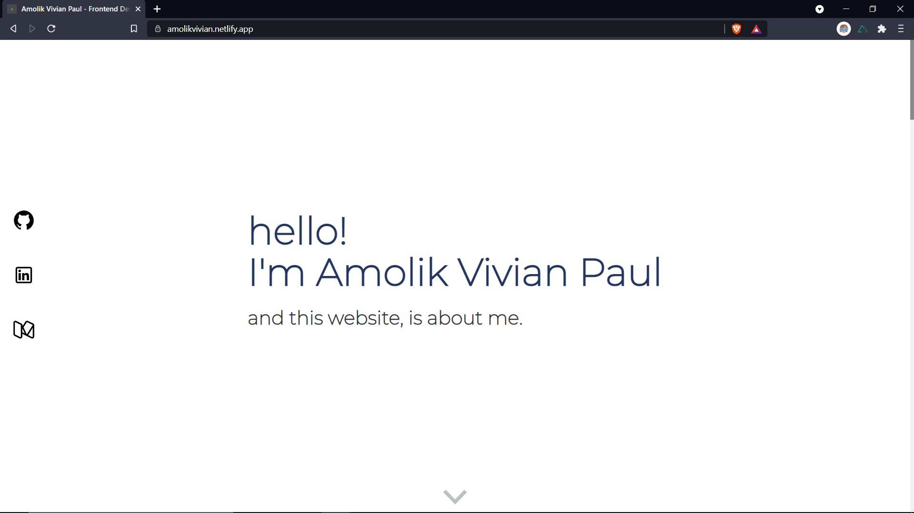

# nuxt-portfolio

Portfolio website developed on Nuxt JS - a framework built on Vue JS.

## Live Demo

The website is currently hosted on Netlify, check it out <a href="https://amolikvivian.netlify.app/" target="_blank">here</a>.

## Screenshots



## Build Setup

```bash
# install dependencies
$ npm install

# serve with hot reload at localhost:3000
$ npm run dev

# build for production and launch server
$ npm run build
$ npm run start

# generate static project
$ npm run generate
```

For detailed explanation on how things work, check out [Nuxt.js docs](https://nuxtjs.org).
